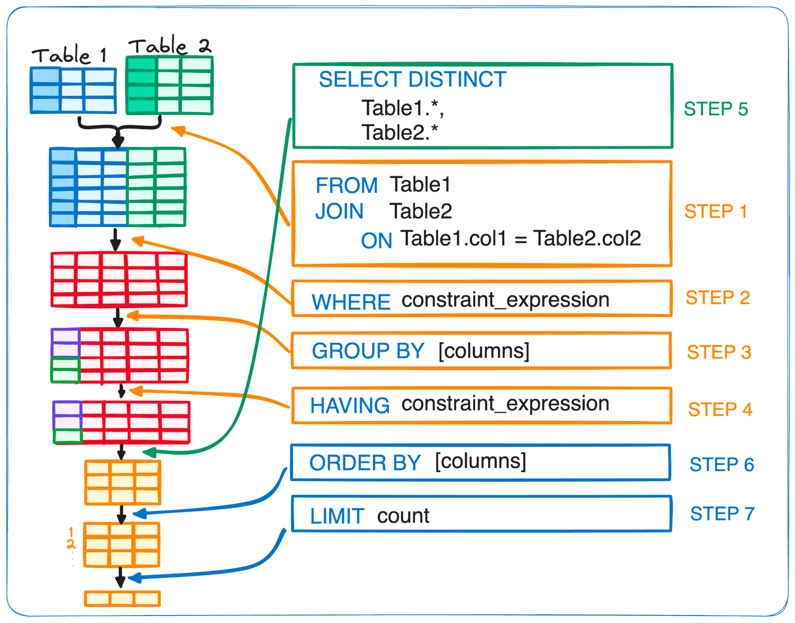

# MySQL Cheatsheet

## SELECT
```sql
SELECT *                                                -- Select all columns from table
FROM table;

SELECT col1, col2, col3                                 -- Select specific columns from table
FROM table;

SELECT names.*                                          -- Select all columns from specific table only
FROM names
INNER JOIN ages
    ON names.id = ages.id;
```

## ALIAS
```sql
SELECT
    long_column_name AS col1,                           -- Rename column using an ALIAS with the keyword AS
    another_long_column_name col2                       -- Rename column without the keyword AS
FROM table;

SELECT long_column_name AS col                          -- ALIAS can be used for column name and table name
FROM table AS t;

SELECT
    t1.col1,
    t2.long_column_name col2
FROM long_table_name_1 t1
INNER JOIN long_table_name_2 t2
    ON t1.id = t2.id                                    -- Use ALIAS for join condition
WHERE t1.col1 = 'value'
    AND t2.long_column_name = 'value';                  -- ALIAS will not work here. Check SQL Query Execution Order

-- NOTE:
-- For table name, once an ALIAS is set always refer using the ALIAS
-- For column name, you can switch between the original name and ALIAS

SELECT t1.id, t1.name first_name
FROM names t1
INNER JOIN ages t2
    -- ON names.id = ages.id                            -- Using original name will give an error. Once given, use ALIAS only
    ON t1.id = t2.id
ORDER BY
    id, first_name;
    -- id, t1.name;                                     -- Unlike table name, you can switch between ALIAS and original name for columns
```

## ORDER OF EXECUTION
```sql
FROM / JOIN   ->   WHERE   ->   GROUP BY   ->   HAVING   ->   SELECT   ->   DISTINCT   ->   ORDER BY   ->   LIMIT

SELECT DISTINCT                                         -- 6. Show only the UNIQUE rows
    t1.customer_first_name customer,                     -- 5. Select the columns required from the tables
    YEAR(t2.order_date) order_year,
    SUM(t2.order_qty) total_orders
FROM inventory t1                                       -- 1. Table with Joins to source data from
INNER JOIN orders t2
    ON t1.order_id = t2.order_id
WHERE t1.col1 = 'value'                                 -- 2. Filter data down to only specific condition
    AND YEAR(t2.order_date) = '2020'
GROUP BY                                                -- 3. Group the data at the Year level
    t1.customer_first_name,                              -- NOTE: The column aliases are unavailable when going by the execution order
    YEAR(t2.order_date)
HAVING
    SUM(t2.order_qty) > 100                             -- 4. Filter out the aggregated/grouped data
ORDER BY                                                -- 7. Order the columns
    col1, order_year                                    -- NOTE: The column aliases are availabe to use for the ORDER BY clause
LIMIT                                                   -- 8. Show only the first 10 rows after they are ordered
    10;
```



## ARITHMETIC OPERATORS
```sql
-- Arithmetic Operators
SELECT 7 % 4;                                           -- 3        - Modulus
SELECT 2 * 3;                                           -- 6        - Multiplcation
SELECT 2 + 2;                                           -- 4        - Addition
SELECT 2 - 2;                                           -- 0        - Subtraction
SELECT 6 / 2;                                           -- 3.0000   - Division
SELECT 3 / 2;                                           -- 1.5000   - Division with decimnal
SELECT 6 DIV 2;                                         -- 3        - DIV operator
```

```sql
-- Calculate annual income when salary is known
WITH data AS (
    SELECT 'Jon' name, 1000 salary UNION
    SELECT 'Sam' name, 5000 salary UNION
    SELECT 'Tim' name, NULL salary
)
SELECT name, salary, (salary * 12) AS annual_income
FROM data;

-- | name | salary | annual_income |
-- |------|--------|---------------|
-- | Jon  | 1000   | 12000         |
-- | Sam  | 5000   | 60000         |
-- | Tim  | NULL   | NULL          |


-- Calculate total cost with 8.25% tax, without using parenthesis or ALIAS keyword AS
WITH data AS (
    SELECT 'A' item, 100 cost UNION
    SELECT 'B' item, 50 cost UNION
    SELECT 'C' item, NULL cost
)
SELECT item, cost, cost + 0.0825 * cost total_cost      -- Follows PEMDAS rule
FROM data;

-- | item | cost | total_cost |
-- |------|------|------------|
-- | A    | 100  | 108.2500   |
-- | B    | 50   | 54.1250    |
-- | C    | NULL | NULL       |
```

## NUMERIC FUNCTIONS
```sql
SELECT PI();                                            -- 3.141593 - Value of Pi
SELECT PI()+0.000000000000000;                          -- 3.141592653589793

SELECT ABS(-10);                                        -- 10       - Absolute
SELECT ABS(5 - 10);                                     -- 5        - Absolute

SELECT CEIL(PI());                                      -- 4.0      - Rounds to next whole number
SELECT CEILING(PI());                                   -- 4.0      - CEIL() is short of CEILING()
SELECT CEIL(22.3);                                      -- 23
SELECT CEIL(105.5);                                     -- 106
SELECT CEIL(-105.5);                                    -- -105     - Next whole number, when negative

SELECT FLOOR(PI());                                     -- 3.0      - Rounds to previous whole number
SELECT FLOOR(22.3);                                     -- 22
SELECT FLOOR(105.5);                                    -- 105
SELECT FLOOR(-105.5);                                   -- -106

SELECT FORMAT(12.3456, 2);                              -- 12.35    - Keeps the specified decimals first and then rounds off number
SELECT FORMAT(12.345678, 2);                            -- 12.35
SELECT FORMAT(12.345678, 3);                            -- 12.346
SELECT FORMAT(99.9999, 2);                              -- 100.00
SELECT FORMAT(0, 2);                                    -- 0.00
SELECT FORMAT(PI(),2);                                  -- 3.14

SELECT ROUND(5.4);                                      -- 5        - Rounds off value
SELECT ROUND(5.5);                                      -- 6
SELECT ROUND(5.6);                                      -- 6
SELECT ROUND('2574.67');                                -- 2575.0   - Can also pass value as a string
SELECT ROUND(-5578.6877);                               -- -5579
SELECT ROUND(-5578.6877, 2);                            -- -5578.69 - Specify the decimal to round off to

SELECT TRUNCATE(123.45678, 3);                          -- 123.456  - TRUNCATE() cuts value off at specified decimal
SELECT TRUNCATE(123.45678, 2);                          -- 123.45   - TRUNCATE() does not round off value as FORMAT()
SELECT TRUNCATE(123.45678, 0);                          -- 123
SELECT TRUNCATE(123.45678, -1);                         -- 120
SELECT TRUNCATE(123.45678, -2);                         -- 100
SELECT TRUNCATE(123.45678, -3);                         -- 0
SELECT TRUNCATE(123.45678, -4);                         -- 0
SELECT TRUNCATE('123.45678','2');                       -- 123.45   - Can also pass value as a string
SELECT TRUNCATE(0, 1);                                  -- 0
SELECT TRUNCATE(0, 5);                                  -- 0

SELECT SIGN(10);                                        -- 1        - Returns 1, if number is positive
SELECT SIGN(-10);                                       -- -1       - Returns -1, if number is negative
SELECT SIGN(0);                                         -- 0        - Returns 0, if number is zero

SELECT SQRT(9);                                         -- 3.0      - Square Root
SELECT SQRT('9');                                       -- 3.0      - Can also pass value as a string
SELECT SQRT(10);                                        -- 3.1622776601683795
SELECT SQRT(-9);                                        -- NULL     - Negative value will give NULL
```

## STRING FUNCTIONS
```sql
SELECT ASCII('A');                                      -- 65       - Returns ASCII value of character
SELECT ASCII('AB');                                     -- 65
SELECT CHAR(65,66);                                     -- AB       - Convert ASCII to character
SELECT SPACE(5);                                        --          - Adds SPACE character

SELECT LENGTH('MySQL');                                 -- 5        - Returns length of string (in bytes)
SELECT CHAR_LENGTH('MySQL');                            -- 5        - Returns length of string (in characters)
SELECT CHAR_LENGTH(10000);                              -- 5        - Returns length of integer
SELECT CHAR_LENGTH(100.00);                             -- 6        - Returns length of float
SELECT CHAR_LENGTH(MySQL);                              -- Error    - String needs to be in quotes
SELECT LENGTH('€');                                     -- 3        - 3 bytes
SELECT CHAR_LENGTH('€');                                -- 1        - 1 character

SELECT UPPER('james');                                  -- JAMES    - Converts to Upper case
SELECT UCASE('james');                                  -- JAMES    - Synonym for UPPER()
SELECT LOWER('JAMES');                                  -- james    - Converts to Lower case
SELECT LCASE('JAMES');                                  -- james    - Synonym for LOWER()
```

## STRING FUNCTIONS (CONT'D)
```sql
SELECT CONCAT('James','Bond');                          -- JamesBond    - Concatenates strings
SELECT CONCAT('James',SPACE(1),'Bond');                 -- James Bond
SELECT CONCAT('James','Bond',007);                      -- JamesBond7   - Can pass nnumerical arguments

SELECT CONCAT_WS(' ','James','Bond');                   -- James Bond   - Concatenates strings with a Separator
SELECT CONCAT_WS(NULL,'James','Bond');                  -- NULL
SELECT CONCAT_WS(',','James','Bond',NULL);              -- James,Bond
SELECT CONCAT_WS(',','James',NULL,'Bond');              -- James,Bond
SELECT CONCAT_WS(',','James','Bond',NULL,'007');        -- James,Bond,007
SELECT CONCAT_WS(CHAR(44),CHAR(97),CHAR(98));           -- A,B

SELECT COALESCE(1, NULL, 2);                            -- 1            - Returns first non-null value
SELECT COALESCE(1, 2, NULL);                            -- 1
SELECT COALESCE(NULL, 1, 2);                            -- 1
SELECT COALESCE(NULL, 2, 1);                            -- 2
SELECT COALESCE(NULL, NULL, 1);                         -- 1
SELECT COALESCE(NULL, NULL, NULL);                      -- NULL         - Returns NULL, if all values are NULL

SELECT CONCAT('a',NULL,'b');                            -- NULL         - NULL in CONCAT NULLs the whole string
SELECT CONCAT('a',COALESCE(NULL,' '),'b');              -- a b          - Use COALESCE to handle NULL values in CONCAT

SELECT
    t1.name,
    COALESCE(t2.firstname, t2.lastname)
FROM table t1
INNER JOIN table t2
    ON t1.name = COALESCE(t2.firstname, t2.lastname);   -- COALESCE on JOIN condition

SELECT INSERT('James B0ND',8,3,'ond');                  -- James Bond   - INSERT(string, position, length, new_string)
SELECT INSERT('Sch00l',4,2,'oo');                       -- School       - Inserts new string in existing string
SELECT INSERT('Sch00l',4,1,'oo');                       -- Schoo0l      - Inserts and replaces the specified length

SELECT INSTR('School','o');                             -- 4            - Returns first occurence of a character in string
SELECT INSTR('Foobarbar','bar');                        -- 4            - Can be multiple characters
SELECT INSTR('Foobarbar','BAR');                        -- 4            - Not case-sensitive

SELECT LOCATE('bar','foobarbar');                       -- 4            - Similar to INSTR, but with different arguments
SELECT LOCATE('bar','foobarbar',4);                     -- 4            - Optional argument to mention start position
SELECT LOCATE('bar','foobarbar',5);                     -- 7            - Example where start position is helpful
SELECT LOCATE('BAR','foobarbar');                       -- 4            - Not case-sensitive

SELECT LEFT('foobarbar',6);                             -- foobar       - Returns leftmost characters as per length
SELECT LEFT('foobarbar',-2);                            --              - Only accepts arguments > 0
SELECT RIGHT('foobarbar',6);                            -- barbar       - Returns rightmost characters as per length

SELECT LTRIM('  barbar');                               -- barbar       - Removes space character on the left
SELECT RTRIM('barbar  ');                               -- barbar       - Removes space character on the right
SELECT RTRIM('  barbar  ');                             --   barbar     - Only removes in the specified direction
SELECT TRIM('  barbar  ');                              -- barbar       - Removes space character from left and right
SELECT TRIM(LEADING 'x' FROM 'xxxbarxxx');              -- barxxx       - TRIM on left side specifying a character
SELECT TRIM(LEADING 'x' FROM 'xyxbarxxx');              -- yxbarxxx
SELECT TRIM(LEADING 'X' FROM 'xyxbarxxx');              -- xyxbarxxx    - Is case sensitive
SELECT TRIM(TRAILING 'x' FROM 'xxxbarxxx');             -- xxxbar       - TRIM on right side specifying a character
SELECT TRIM(BOTH 'x' FROM 'xxxbarxxx');                 -- bar          - TRIM on both side specifying a character

SELECT SUBSTRING('Hello, World!',8,6);                  -- World!       - Extracts substring from string; SUBSTRING(str, pos, len)
SELECT SUBSTRING('Hello, World!',8);                    -- World!       - length argument is optional
SELECT SUBSTRING('Hello, World!' FROM 8);               -- World!
SELECT SUBSTRING('Hello, World!' FROM 8 FOR 6);         -- World!
SELECT MID('Hello, World!',8,6);                        -- World!       - Similar to SUBSTRING; MID(str, pos, len)

SELECT SUBSTRING_INDEX('www.google.com', '.', 1);       -- www          - Extracts substring; SUBSTRING_INDEX(str, delim, count)
SELECT SUBSTRING_INDEX('www.google.com', '.', 2);       -- www.google   - Specify the start position of the character
SELECT SUBSTRING_INDEX('www.google.com', '.', -1);      -- com          - Direction can be reversed
SELECT SUBSTRING_INDEX('www.google.com', '.', -2);      -- google.com

SELECT REPLACE('google.com','com','ai');                -- google.ai    - Replaces specified part of the string
SELECT REPLACE('google.com','COM','AI');                -- google.com   - Is case sensitive
SELECT REVERSE('Hello, World!');                        -- !olleH       - Reverses a string
SELECT REPEAT('Hello',2);                               -- HelloHello   - Repeats string n number of times
```
<br>

## STRING FUNCTIONS (CONT'D)
```sql
SELECT 'Hello World' REGEXP '^H';                       -- 1            - Search string using Regular Expressions (RegEx)
SELECT 'World' REGEXP '^H';                             -- 0            - Returns 1 if TRUE; 0 if FALSE

SELECT STRCMP('Hello','Hello');                         -- 0            - Returns 0, if string1 = string2
SELECT STRCMP('Hello','Hello1');                        -- -1           - Returns -1, if string1 < string2
SELECT STRCMP('Hello1','Hello');                        -- 1            - Returns 1, if string1 > string2

SELECT ELT(2,'Apple','Ball','Cat');                     -- Ball         - Similar to Python list, returns string as N position
SELECT FIELD('Ball','Apple','Ball','Cat');              -- 2            - Returns index of string in first argument
SELECT FIND_IN_SET('b','a,b,c,d');                      -- 2            - Returns index of comma separated string

SELECT LPAD('Hello',10,'!');                            -- !!!!!Hello   - Returns string with specified character as padding
SELECT RPAD('Hello',10,'!');                            -- Hello!!!!!   - Direction can be left or right
SELECT RPAD('Hello',4,'!');                             -- Hell         - Result when length is less than string length
```

## STRING EXTRACTION
```sql
SET @string = 'LAX/Los Angeles';

-- Extract the substring left of the '/' character
SELECT SUBSTRING_INDEX('LAX/Los Angeles','/',1);                                -- LAX
SELECT SUBSTRING_INDEX(@string,'/',1);                                          -- LAX
SELECT LEFT(@string, LOCATE('/',@string) - 1);                                  -- LAX

-- Extract the substring right of the '/' character
SELECT SUBSTRING_INDEX(@string,'/',-1);                                         -- Los Angeles
SELECT RIGHT(@string, LENGTH(@string) - LOCATE('/',@string));                   -- Los Angeles

SET @string2 = 'Item: Red Chair [$10]';

-- Extract the substring after ':' and before '['
SELECT @string2;                                                                -- Item: Red Chair [$10]
SELECT SUBSTRING_INDEX(@string2,'[',1);                                         -- Item: Red Chair
SELECT SUBSTRING_INDEX(SUBSTRING_INDEX(@string2,'[',1),':',-1);                 --  Red Chair
SELECT TRIM(SUBSTRING_INDEX(SUBSTRING_INDEX(@string2,'[',1),':',-1));           -- Red Chair

SELECT
    TRIM(RIGHT(
            LEFT(@string2, LOCATE('[',@string2) - 1),
                LENGTH(LEFT(@string2, LOCATE('[',@string2) - 1)) -
                LOCATE(':',LEFT(@string2, LOCATE('[',@string2) - 1))
        ));                                                                     -- Red Chair
```

## DATE FUNCTIONS
```sql
SELECT CURDATE();                                       -- 2023-12-31   - Get current date
SELECT CURRENT_DATE();                                  -- 2023-12-31
SELECT CURRENT_DATE;                                    -- 2023-12-31
SELECT CURRENT_TIME();                                  -- 18:10:59     - Get current time
SELECT CURRENT_TIMESTAMP();                             -- 2023-12-31 18:10:59
SELECT TIME(CURRENT_TIMESTAMP());                       -- 18:10:59     - Extract time for current timestamp
SELECT NOW();                                           -- 2023-12-31 18:10:59
SELECT DATE(NOW());                                     -- 2023-12-31

SELECT UPPER(DATE_FORMAT('2023-12-31','%c-%b-%y'));     -- 31-DEC-23    - Convert date to string in specific format
SELECT STR_TO_DATE('12/31/2023','%m/%d/%Y');            -- 2023-12-31   - Convert string in specific format to date
SELECT YEAR(STR_TO_DATE('12/31/2023','%m/%d/%Y'));      -- 2023         - Once converted to date, we can use date functions
SELECT YEAR('2023-12-31');                              -- 2023         - String in specific format is auto recognized as date

SELECT YEAR(CURDATE());                                 -- 2023         - Extract Year from current date
SELECT YEAR(NOW());                                     -- 2023
SELECT QUARTER('2023-12-31');                           -- 4            - Extract Quarter
SELECT MONTH('2023-12-31');                             -- 12           - Extract Month
SELECT WEEK('2023-12-31');                              -- 53           - Extract Week
SELECT WEEK('2023-12-31', 3);                           -- 52           - Extract Week as per ISO 8601 date standard
SELECT WEEKDAY('2023-12-31');                           -- 6            - Range from 0 to 6, where Monday = 0 and Sunday = 6
SELECT DAY('2023-12-31');                               -- 31           - Extract Date
SELECT YEARWEEK('2023-12-31');                          -- 202353       - Extract YearWeek
```

## DATE FUNCTIONS (CONT'D)
```sql
SELECT TIME('2023-12-31 18:10:59');                     -- 18:10:59     - Extract Time
SELECT TIME('18:10:59');                                -- 18:10:59
SELECT DAYOFYEAR('2023-12-31');                         -- 365          - Day of Year
SELECT DAYOFMONTH('2023-12-31');                        -- 31           - Day of Month
SELECT DAYOFWEEK('2023-12-31');                         -- 1            - Sunday being the first day of the week
SELECT DAYNAME('2023-12-31');                           -- Sunday

-- Date Arithmetics
SELECT CURRENT_DATE() + 1;                              -- 20240101     - Add days
SELECT CURRENT_DATE() - 1;                              -- 20231230     - Subtract days
SELECT DATE_ADD(CURRENT_DATE(), INTERVAL 1 DAY);        -- 2024-01-01
SELECT DATE_ADD('2023-12-31', INTERVAL 1 DAY);          -- 2024-01-01   -- Add date; Synonym ADD_DATE()
SELECT DATE_SUB('2023-12-31', INTERVAL 1 DAY);          -- 2023-12-30   -- Subtract date; Synonym SUB_DATE()

SELECT DATE_ADD('2023-12-31', 1);                       -- 2024-01-01   - Day interval by default
SELECT DATE_ADD('2023-12-31', INTERVAL 1 DAY);          -- 2024-01-01   - Specify interval explicitly
SELECT DATE_ADD('2023-12-31', INTERVAL 1 YEAR);         -- 2024-12-31
SELECT DATE_ADD('2023-12-31', INTERVAL 1 QUARTER);      -- 2024-03-31
SELECT DATE_ADD('2023-12-31', INTERVAL 1 MONTH);        -- 2024-01-31
SELECT DATE_ADD('2023-12-31', INTERVAL 1 WEEK);         -- 2024-01-07

SELECT DATEDIFF('2023-12-31','2023-12-01');             -- 30           - Calculate difference between two dates
SELECT DATEDIFF('2023-12-01','2023-12-31');             -- -30          - Later date first for positive result

SELECT DATE_FORMAT('2023-12-31','%Y-%m-01');            -- 2023-12-01   - First day of the month
SELECT DATE_SUB('2023-12-31', INTERVAL DAYOFMONTH('2023-12-31')-1 DAY); -- 2023-12-01
SELECT LAST_DAY('2023-12-01');                          -- 2023-12-31   - Last day of the month
SELECT DATE_FORMAT('2023-12-31','%Y-01-01');            -- 2023-01-01   - First day of current year
```
<br>
<br>
<br>
<br>
<br>
<br>
<br>
<br>
<br>
<br>
<br>
<br>
<br>
<br>
<br>
<br>
<br>
<br>
<br>
<br>
<br>
<br>
<br>
<br>
<br>
<br>
<br>

##  JOINS
```sql
DROP TABLE IF EXISTS orders, customers;
CREATE TABLE customers (name VARCHAR(10), age INT, city VARCHAR(10));
CREATE TABLE orders (order_no INT, customer VARCHAR(10), price INT);
INSERT INTO customers VALUES ('Jon', 20, 'New York'), ('Jim', 22, 'Seattle'), ('Sam', 19, 'Austin'), (NULL, NULL, NULL);
INSERT INTO orders VALUES (1, 'Jim', 200), (2, 'Sam', 250), (3, 'Ryan', 300), (NULL, NULL, NULL);

--              Orders                                                      Customers
-- |-----------------------------|                                  |------------------------|
-- | order_no | customer | price |                                  | name | age  | city     |
-- |----------|----------|-------|                                  |------|------|----------|
-- | 1        | Jim      | 200   |                                  | Jon  | 20   | New York |
-- | 2        | Sam      | 250   |                                  | Jim  | 22   | Seattle  |
-- | 3        | Ryan     | 300   |                                  | Sam  | 19   | Austin   |
-- | NULL     | NULL     | NULL  |                                  | NULL | NULL | NULL     |

-- INNER JOIN, Synonym: JOIN
-- NOTE: NULL row won't show up as NULL is not a valid key
SELECT *
FROM customers
INNER JOIN orders
    ON customers.name = orders.customer;

-- | name | age | city    | order_no | customer | price |
-- |------|-----|---------|----------|----------|-------|
-- | Jim  | 22  | Seattle | 1        | Jim      | 200   |
-- | Sam  | 19  | Austin  | 2        | Sam      | 250   |

-- LEFT JOIN, Synonym: LEFT OUTER JOIN
SELECT *
FROM customers
LEFT JOIN orders
    ON customers.name = orders.customer;

-- | name | age  | city     | order_no | customer | price |
-- |------|------|----------|----------|----------|-------|
-- | Jon  | 20   | New York | NULL     | NULL     | NULL  |
-- | Jim  | 22   | Seattle  | 1        | Jim      | 200   |
-- | Sam  | 19   | Austin   | 2        | Sam      | 250   |
-- | NULL | NULL | NULL     | NULL     | NULL     | NULL  |

-- RIGHT JOIN, Synonym: RIGHT OUTER JOIN
SELECT *
FROM customers
RIGHT JOIN orders
    ON customers.name = orders.customer;

-- | name | age  | city    | order_no | customer | price |
-- |------|------|---------|----------|----------|-------|
-- | Jim  | 22   | Seattle | 1        | Jim      | 200   |
-- | Sam  | 19   | Austin  | 2        | Sam      | 250   |
-- | NULL | NULL | NULL    | 3        | Ryan     | 300   |
-- | NULL | NULL | NULL    | NULL     | NULL     | NULL  |

-- CROSS JOIN, Synonym: t1, t2
-- NOTE: No JOIN condition required, as table1 will match with every row of table2 and vice versa.
WITH t1 AS (
    SELECT 'a' col_a UNION SELECT 'b'
),t2 AS (
    SELECT 'c' col_b UNION SELECT 'd'
)
SELECT *
FROM t1 CROSS JOIN t2;
-- FROM t1, t2;                                         -- Synonym

-- | col_a | col_b |
-- |-------|-------|
-- | b     | c     |
-- | a     | c     |
-- | b     | d     |
-- | a     | d     |
```
<br>

## JOINS (CONT'D)
```sql
-- FULL OUTER JOIN, Synonym: FULL JOIN
SELECT *
FROM customers
FULL OUTER JOIN orders
    ON customers.name = orders.customer;

-- NOTE: MySQL does not have FULL OUTER JOIN, so here is the alternate solution
-- NOTE: Since NULL is not a valid key, below is how the NULL values from both table will show up
SELECT * FROM customers
LEFT JOIN orders ON customers.name = orders.customer
UNION
SELECT * FROM customers
RIGHT JOIN orders ON customers.name = orders.customer;

-- | name | age  | city     | order_no | customer | price |
-- |------|------|----------|----------|----------|-------|
-- | Jon  | 20   | New York | NULL     | NULL     | NULL  |
-- | Jim  | 22   | Seattle  | 1        | Jim      | 200   |
-- | Sam  | 19   | Austin   | 2        | Sam      | 250   |
-- | NULL | NULL | NULL     | NULL     | NULL     | NULL  |
-- | NULL | NULL | NULL     | 3        | Ryan     | 300   |

-- SELF JOIN
-- Join a table with itself
SELECT *
FROM customers a
INNER JOIN customers b
    ON a.age = b.age + 2;

-- | name | age | city    | name | age | city     |
-- |------|-----|---------|------|-----|----------|
-- | Jim  | 22  | Seattle | Jon  | 20  | New York |

SELECT *
FROM customers a, customers b                           -- Same result as above, but using CROSS JOIN
WHERE a.age = b.age + 2;

-- JOIN MUTLIPLE TABLES
-- Real world example of joining multiple tables

SELECT customers.*, inventory.*, orders.*, warehouse.*
FROM customers
INNER JOIN inventory
    ON orders.id = inventory.order_id
LEFT JOIN orders
    ON customer.name = orders.customer
    AND customer.order_id = orders.order_id             -- Use AND to add multiple joining conditions
RIGHT JOIN warehouse
    ON warehouse.id = orders.warehouse_id               -- Join with orders table
    AND warehouse.location = orders.location_id;

-- JOIN CONDITION issue
-- NOTE: Performing a join on a non-unique key column will cause duplication of rows. To avoid the following issue, better data modelling
-- practices should be implemented such as, t_orders should have the last name on the order, t_customers should have order_id.

WITH t_orders AS (
    SELECT 1 id, 'John' name, 10 qty UNION SELECT 2 id, 'Sam' name, 5 qty
), t_customers AS (
    SELECT 'John' fname, 'Smith' lname UNION SELECT 'John' fname, 'McClaine' lname UNION SELECT 'Sam' fname, 'Davis' lname
)
SELECT *
FROM t_orders t1
LEFT JOIN t_customers t2
    ON t1.name = t2.fname;

-- | id | name | qty | fname | lname    |
-- |----|------|-----|-------|----------|
-- | 1  | John | 10  | John  | Smith    |
-- | 1  | John | 10  | John  | McClaine |
-- | 2  | Sam  | 5   | Sam   | Davis    |
```
<br>

## WHERE CLAUSE
```sql
DROP TEMPORARY TABLE IF EXISTS orders;
CREATE TEMPORARY TABLE orders (id INT,country VARCHAR(20),language VARCHAR(20),order_date DATE,units INT);
INSERT INTO orders VALUES (101,'India','Hindi','2023-01-01',10),(102,'United States','English','2023-01-15',12),(103,'United Kingdom','English','2023-02-01',15),
    (104,'France','French','2024-02-15',20),(105,'China','Mandarin','2024-03-01',18),(106,NULL,NULL,'2024-04-01',22);

-- | id  | country        | language | order_date | units |
-- |-----|----------------|----------|------------|-------|
-- | 101 | India          | Hindi    | 2023-01-01 | 10    |
-- | 102 | United States  | English  | 2023-01-15 | 12    |
-- | 103 | United Kingdom | English  | 2023-02-01 | 15    |
-- | 104 | France         | French   | 2024-02-15 | 23    |
-- | 105 | China          | Mandarin | 2024-03-01 | 18    |
-- | 106 | NULL           | NULL     | NULL       | 22    |

SELECT *
FROM orders
WHERE id = 101;                                 -- Numeric fields do not require quotes

SELECT *
FROM orders
WHERE country = 'india';                        -- Character fields always require quotes, NOT case-sensitive

SELECT *
FROM orders
WHERE country IN ('india','china');             -- IN operator to search for multiple values

SELECT *
FROM orders
WHERE country NOT IN ('India','China');         -- NOT IN operator to exclude multiple values

SELECT *
FROM orders
WHERE country IS NULL;                          -- IS operator to search NULL values; NULL has no quotes

SELECT *
FROM orders
WHERE country IS NOT NULL;                      -- IS NOT operator to exclude NULL values

SELECT *
FROM orders
WHERE country LIKE 'united%';                   -- LIKE operator for wildcard characters, NOT case-sensitive

SELECT *
FROM orders
WHERE country NOT LIKE 'United%';               -- NOT LIKE operator to exclude wildcard characters

--WHERE country LIKE 'i%';                      -- India    - starts with a
--WHERE country LIKE '%e';                      -- France   - ends with e
--WHERE country LIKE '%r%';                     -- France   - contains the letter r
--WHERE country LIKE 'c%a';                     -- China    - starts with c and ends with a
--WHERE country LIKE '_r%';                     -- France   - has char 'r' in the second position
--WHERE country LIKE 'United ______%';          -- US, UK   - has atleast 6 characters
--WHERE country LIKE 'United _______%';         -- UK       - has atleast 7 characters

SELECT *
FROM orders
WHERE country REGEXP '^i'                       -- starts with letter i, REGEXP is NOT case-sensitive
--WHERE BINARY country REGEXP BINARY '[I]'      -- India; search for uppercase I by converting column to BINARY

SELECT *
FROM orders
WHERE order_date >= '2024-02-15';               -- Greater than and equal to

SELECT *
FROM orders
WHERE order_date < '2024-02-15';                -- Lesser than

SELECT *
FROM orders
WHERE order_date <> '2024-02-15';               -- Not equal to. Can use != operator as well like in Python
```

## WHERE CLAUSE (CONT'D)
```sql
SELECT *
FROM orders
WHERE order_date BETWEEN '2023-01-01' AND '2024-02-15';                     -- Inclusive of both dates
--WHERE order_date >= '2023-01-01' AND order_date <= '2024-02-15';          -- Equivalent, with explicit mention of inclusivity

SELECT *
FROM orders
WHERE order_date BETWEEN '2024-02-15' AND '2023-01-01';                     -- No result; Lower value should always be first

SELECT *
FROM orders
WHERE YEAR(order_date) = '2023';                -- String functions can be used
--WHERE YEAR(order_date) = 2023;                -- String function convert value to INT, so no need to use quotes
--WHERE YEAR(order_date) = YEAR(CURDATE());

SELECT *
FROM orders o
LEFT JOIN customers c
    ON o.customer_id = c.customer_id
    AND YEAR(c.order_date) = 2023               -- Filter condition in JOIN to optimize performance

SELECT *
FROM orders
WHERE (YEAR(order_date) = '2023'
    AND BINARY country REGEXP BINARY '[I]')
    OR country = 'China';                       -- Use parenthesis to combine filtering criteria

SELECT *
FROM orders
WHERE YEAR(order_date) = '2023'
    AND (BINARY country REGEXP BINARY '[I]'
        OR country = 'China');                  -- Same filters, but different parenthesis changes filtering criteria

-- Find Year with total orders more than 40
SELECT *
FROM orders
WHERE YEAR(order_date) = '2023'
AND SUM(units) > 41;                            -- ERROR; you cannot use aggregate functions in WHERE clause

-- Method 1 - Using HAVING clause
SELECT YEAR(order_date) year, SUM(units) total_units
FROM orders
GROUP BY YEAR(order_date)
HAVING SUM(units) > 40;                         -- HAVING clause is the filter for aggregate functions

-- Method 2 - Using Commmon Table Expressions (CTE)
WITH data AS (
    SELECT YEAR(order_date) year, SUM(units) total_units
    FROM orders
    GROUP BY YEAR(order_date)
)
SELECT year, total_units
FROM data
WHERE total_units > 40;

-- Method 3 - Using Derived Table
SELECT year, total_units
FROM (SELECT YEAR(order_date) year, SUM(units) total_units
        FROM orders
        GROUP BY YEAR(order_date)) t
WHERE total_units > 40;

-- Method 4 - Using CTE and Window Function
WITH data AS (
    SELECT DISTINCT YEAR(order_date) year, SUM(units) OVER (PARTITION BY YEAR(order_date)) total_units
    FROM orders
)
SELECT year, total_units
FROM data
WHERE total_units > 40;
```
<br>

## AGGREGATE FUNCTIONS
```sql
DROP TEMPORARY TABLE IF EXISTS employee;
CREATE TEMPORARY TABLE employee (id INT, name VARCHAR(10), salary INT);
INSERT INTO employee VALUES (1, 'A', 40), (2, 'B', 60), (3, 'C', 60), (4, 'D', 70), (5, 'E', 80), (6, 'F', NULL);

-- | id | name | salary |
-- |----|------|--------|
-- | 1  | A    | 40     |
-- | 2  | B    | 60     |
-- | 3  | C    | 60     |
-- | 4  | D    | 70     |
-- | 5  | E    | 80     |
-- | 6  | F    | NULL   |

SELECT COUNT(*)                 FROM employee;          -- 6            - Counts distinct rows in whole table
SELECT COUNT(1)                 FROM employee;          -- 6            - Same as COUNT(*)
SELECT COUNT(salary)            FROM employee;          -- 5            - NULL values are not counted
SELECT COUNT(DISTINCT salary)   FROM employee;          -- 4            - NULL values are not counted
SELECT SUM(salary)              FROM employee;          -- 310
SELECT SUM(DISTINCT salary)     FROM employee;          -- 250          - NULL values are not counted
SELECT AVG(salary)              FROM employee;          -- 62.0000      - 310/5
SELECT AVG(DISTINCT salary)     FROM employee;          -- 62.5000      - 250/4
SELECT MIN(salary)              FROM employee;          -- 40           - NULL values are excluded
SELECT MAX(salary)              FROM employee;          -- 80
SELECT STDDEV(salary)           FROM employee;          -- 13.2664...   - Std Deviation Population; also STDDEV_POP()
SELECT STDDEV_SAMP(salary)      FROM employee;          -- 14.8323...   - Std Deviation Sample
```

## GROUP BY CLAUSE
```sql
DROP TEMPORARY TABLE IF EXISTS orders;
CREATE TEMPORARY TABLE orders (id INT, name VARCHAR(10), product VARCHAR(10), units INT);
INSERT INTO orders VALUES (1,'John','iPad',5), (2,'John','iPhone',10), (3,'Sam','iPhone',20), (4,'Sam','Macbook',5), (5,'Tim','Macbook',5), (6,'Zoe','iPhone',10);

-- | id | name | product | units |
-- |----|------|---------|-------|
-- | 1  | John | iPad    | 5     |
-- | 2  | John | iPhone  | 10    |
-- | 3  | Sam  | iPhone  | 20    |
-- | 4  | Sam  | Macbook | 5     |
-- | 5  | Tim  | Macbook | 5     |
-- | 6  | Zoe  | iPhone  | 10    |

SELECT COUNT(1), SUM(units)                             -- GROUP BY clause is not mentioned as we are not grouping
FROM orders;                                            -- by a specific column, but by the whole table

-- | COUNT(1) | SUM(units) |                            -- Without column ALIAS, this is how column headers show
-- |----------|------------|
-- | 6        | 55         |

SELECT product, COUNT(1) total_count, SUM(units) AS total_units
FROM orders
GROUP BY product;                                       -- GROUP BY is required when grouping by a specific column

-- | product | total_count | total_units |
-- |---------|-------------|-------------|
-- | iPhone  | 3           | 40          |
-- | iPad    | 1           | 5           |
-- | Macbook | 2           | 10          |

SELECT product, SUM(units) total_units                  -- Mentioning the aggregation SUM(units) in the SELECT statement is optional, if we
FROM orders                                             -- only want product names in the final result
GROUP BY product
HAVING SUM(units) >= 10;                                -- HAVING clause is the WHERE clause for aggregated data

-- | product | total_units |
-- |---------|-------------|
-- | iPhone  | 40          |
-- | Macbook | 10          |
```
<br>

## GROUP BY CLAUSE (CONT'D)
```sql
-- GROUP BY level
-- Grouping is performed at the column level, but that column can have its original level modified as well
-- In the following example, we are modified the date level to the year level

SELECT YEAR(order_date) year, SUM(units) total_units    -- YEAR function is converting order_date to YEAR in SELECT only
FROM orders
GROUP BY order_date;                                    -- Grouping at the individual order dates

-- | year | total_units |
-- |------|-------------|
-- | 2023 | 10          |
-- | 2023 | 12          |
-- | 2023 | 15          |
-- | 2024 | 23          |
-- | 2024 | 18          |
-- | NULL | 22          |

SELECT YEAR(order_date) year, SUM(units) total_units
FROM orders
GROUP BY YEAR(order_date);                              -- Use YEAR function to group at the year level of order dates

-- | year | total_units |
-- |------|-------------|
-- | 2023 | 37          |
-- | 2024 | 41          |
-- | NULL | 22          |

-- Group the following data at the category level, where iPhone = Phone and MacBook = Laptop
-- In the following example, we are modifying the product level to the category level

WITH t_orders AS (
    SELECT 1 id, 'iPhone 15 Pro Max' product, 5  units UNION
    SELECT 2 id, 'iPhone 15 Pro'     product, 10 units UNION
    SELECT 4 id, 'MacBook Air 15'    product, 8  units UNION
    SELECT 5 id, 'MacBook Air 13'    product, 10 units
)
SELECT * FROM t_orders;

-- | id | product           | units |
-- |----|-------------------|-------|
-- | 1  | iPhone 15 Pro Max | 5     |
-- | 2  | iPhone 15 Pro     | 10    |
-- | 4  | MacBook Air 15    | 8     |
-- | 5  | MacBook Air 13    | 10    |

WITH t_orders AS (
    SELECT 1 id, 'iPhone 15 Pro Max' product, 5  units UNION
    SELECT 2 id, 'iPhone 15 Pro'     product, 10 units UNION
    SELECT 4 id, 'MacBook Air 15'    product, 8  units UNION
    SELECT 5 id, 'MacBook Air 13'    product, 10 units
)
SELECT
    CASE
        WHEN product LIKE 'iPhone%' THEN 'Phone'
        WHEN product LIKE 'MacBook%' THEN 'Laptop'
    END category,
    SUM(CASE
            WHEN product LIKE 'iPhone%' THEN units
            WHEN product LIKE 'MacBook%' THEN units
        END) total_units
FROM t_orders
GROUP BY
    CASE
        WHEN product LIKE 'iPhone%' THEN 'Phone'
        WHEN product LIKE 'MacBook%' THEN 'Laptop'
    END;                                                -- NOTE: column ALIAS is not required here

-- | category | total_units |
-- |----------|-------------|
-- | Phone    | 15          |
-- | Laptop   | 18          |
```

## ORDER BY CLAUSE

```sql
DROP TEMPORARY TABLE IF EXISTS orders;
CREATE TEMPORARY TABLE orders (id VARCHAR(10), name VARCHAR(10), product VARCHAR(10), units INT);
INSERT INTO orders VALUES ('001','John','Apple',10),('0012','John','Pear',5),('003','Sam','Banana','20'),('005','Sam','Durian',5),
    ('007','Tim','Beet',5),('010','Tim','Pear',10);

-- | id   | name | product | units |
-- |------|------|---------|-------|
-- | 001  | John | Apple   | 10    |
-- | 0012 | John | Pear    | 5     |
-- | 003  | Sam  | Banana  | 20    |
-- | 005  | Sam  | Durian  | 5     |
-- | 007  | Tim  | Beet    | 5     |
-- | 010  | Tim  | Pear    | 10    |

SELECT name, product
FROM orders                                             -- Order can be set per column, using ASC for Ascending and DESC for Descending
ORDER BY name DESC, product;                            -- Ascending Order is by default, so no need to mention it explicitly like DESC

-- | name | product |
-- |------|---------|
-- | Tim  | Beet    |
-- | Tim  | Pear    |
-- | Sam  | Banana  |
-- | Sam  | Durian  |
-- | John | Apple   |
-- | John | Pear    |

SELECT name, product                                    -- Column order as shown in the SELECT statement, will get utilized in the ORDER BY
FROM orders                                             -- clause. This is because as per Order of Execution SELECT statement is evaluated
ORDER BY 1 DESC, 2 ASC;                                 -- before the ORDER BY clause at runtime. This will give the same result as above.

SELECT name, SUM(units) total_unit
FROM orders
GROUP BY name
ORDER BY total_unit DESC;                               -- We can utilize the ALIAS in the SELECT statement for ordering
-- ORDER BY SUM(units) DESC;                            -- If the ALIAS wasn't mentioned, we can use the following for ordering too

-- | name | total_unit |
-- |------|------------|
-- | Sam  | 25         |
-- | John | 15         |
-- | Tim  | 15         |

SELECT id
FROM orders
ORDER BY id;                                            -- Since the id is of type VARCHAR, it gets ordered using ASCII or alphabetically

-- | id   |
-- |------|
-- | 001  |
-- | 0012 |
-- | 003  |
-- | 005  |
-- | 007  |
-- | 010  |

SELECT id                                               -- The id column stays as VARCHAR type in SELECT
FROM orders
ORDER BY CAST(id AS SIGNED) ASC;                        -- To order numerically, we only need to convert id to INT64 in ORDER BY clause

-- | id   |
-- |------|
-- | 001  |
-- | 003  |
-- | 005  |
-- | 007  |
-- | 010  |
-- | 0012 |

-- NOTE:
-- In MySQL, you can order by a column, that is not in the SELECT statement but exists in the table.
```

## SET THEORY

```sql
DROP TABLE IF EXISTS t1, t2;
CREATE TABLE t1 ( id INT ); CREATE TABLE t2 ( id INT );
INSERT INTO t1 VALUES (1),(2),(3),(NULL); INSERT INTO t2 VALUES (1),(1),(3),(NULL);

--    t1                       t2
-- |------|                 |------|
-- | id   |                 | id   |
-- |------|                 |------|
-- | 1    |                 | 1    |
-- | 2    |                 | 1    |
-- | 3    |                 | 3    |
-- | NULL |                 | NULL |

SELECT id FROM t1
UNION ALL                                           -- Combine all results into a single result, KEEPING any duplicates
SELECT id FROM t2;

-- | id   |
-- |------|
-- | 1    |
-- | 2    |
-- | 3    |
-- | NULL |
-- | 1    |
-- | 1    |
-- | 3    |
-- | NULL |

SELECT id FROM t1
UNION                                               -- Combine all results into a single result, REMOVING any duplicates
SELECT id FROM t2;

-- | id   |
-- |------|
-- | 1    |
-- | 2    |
-- | 3    |
-- | NULL |

SELECT id FROM t1
INTERSECT                                           -- Keeps only unique values between two results
SELECT id FROM t2;

-- | id   |
-- |------|
-- | 1    |
-- | 3    |
-- | NULL |

SELECT id FROM t1
EXCEPT                                              -- Keeps only the values from the first result, that are not present in the second
SELECT id FROM t2;

-- | id   |
-- |------|
-- | 2    |

( SELECT 'table1' tname, id FROM t1 UNION SELECT 'table2', id FROM t2 ) INTERSECT
( SELECT 'table1', 3 id )                           -- Using parenthesis, we get a variety of options to control the result

-- | tname  | id |
-- |--------|----|
-- | table1 | 3  |

-- General Syntax
SELECT id, fname, lname FROM t1                     -- The results that are getting combined should have the exact same number of columns
UNION                                               -- In case the column from first result is not present in the second, set a NULL column
SELECT id, fname, NULL FROM t2
UNION
SELECT id, NULL, NULL FROM t3                       -- The column aliases will be grabbed from the first result, so no need to mention again
ORDER BY id;                                        -- Ordering can be set at the very end
```

## CASE / SWITCH CASE STATEMENT

```sql
-- General Syntax for CASE statement (also known as SWITCH CASE statement):

-- SELECT col1, col2,
--     CASE
--         WHEN <first condition to evaluate>              THEN <value 1>
--         WHEN <second condition to evaluate>             THEN <value 2>
--         WHEN <third condition> AND <fourth condtion>    THEN <value 3>      -- Logical Operators for evaluating multiple conditions
--         WHEN <fifth condition> OR <sixth condtion>      THEN <value 4>
--         ELSE <value 5>                                                      -- Catch all for ones that don't satisfy any above conditions
--     END AS alias_name
-- FROM tablename;

DROP TABLE IF EXISTS sales;
CREATE TABLE sales (id INT, product VARCHAR(20), color VARCHAR(10), order_status INT, units INT);
INSERT INTO sales VALUES (1,'iPhone 15 Pro Max','Black',1,10), (2,'iPhone 15 Pro','Black',1,20), (3,'iPhone 15','Gray',2,15), (4,'MacBook Air 13','Black',3,25), (5,'MacBook Air 15','Gray',4,5), (6,'MacBook Air 13','Black',NULL,15);

-- | id | product           | color | order_status | units |
-- |----|-------------------|-------|--------------|-------|
-- | 1  | iPhone 15 Pro Max | Black | 1            | 10    |
-- | 2  | iPhone 15 Pro     | Black | 1            | 20    |
-- | 3  | iPhone 15         | Gray  | 2            | 15    |
-- | 4  | MacBook Air 13    | Black | 3            | 25    |
-- | 5  | MacBook Air 15    | Gray  | 4            | 5     |
-- | 6  | MacBook Air 13    | Black | NULL         | 15    |

-- CASE statement in SELECT
SELECT
    id, product, color, units, order_status,
    CASE
        WHEN order_status = 1 THEN 'Pending'
        WHEN order_status = 2 THEN 'Processing'
        WHEN order_status = 3 THEN 'Rejected'
        WHEN order_status = 4 THEN 'Completed'
        ELSE 'Error'
    END status_desc,
    CASE
        WHEN product LIKE 'iPhone%' THEN 'Phone'
        WHEN product LIKE 'MacBook%' THEN 'Laptop'
    END category
FROM sales;

-- | id | product           | color | units | order_status | status_desc | category |
-- |----|-------------------|-------|-------|--------------|-------------|----------|
-- | 1  | iPhone 15 Pro Max | Black | 10    | 1            | Pending     | Phone    |
-- | 2  | iPhone 15 Pro     | Black | 20    | 1            | Pending     | Phone    |
-- | 3  | iPhone 15         | Gray  | 15    | 2            | Processing  | Phone    |
-- | 4  | MacBook Air 13    | Black | 25    | 3            | Rejected    | Laptop   |
-- | 5  | MacBook Air 15    | Gray  | 5     | 4            | Completed   | Laptop   |
-- | 6  | MacBook Air 13    | Black | 15    | NULL         | Error       | Laptop   |

-- We can utilize CASE statements to create separate columns for Members (pending, processing, rejected, etc.) of a Dimension (order_status)
-- In the following example, we are separating the members and grouping them at an existing Product level to get a count of order_status
SELECT
    product,
    SUM(CASE WHEN order_status = 1 THEN 1 ELSE 0 END) AS pending,
    SUM(CASE WHEN order_status = 2 THEN 1 ELSE 0 END) AS processing,
    SUM(CASE WHEN order_status = 3 THEN 1 ELSE 0 END) AS rejected,
    SUM(CASE WHEN order_status = 4 THEN 1 ELSE 0 END) AS completed,
    SUM(CASE WHEN order_status IS NULL THEN 1 ELSE 0 END) AS error
FROM sales
GROUP BY
    product;

-- | product           | pending | processing | rejected | completed | error |
-- |-------------------|---------|------------|----------|-----------|-------|
-- | iPhone 15 Pro Max | 1       | 0          | 0        | 0         | 0     |
-- | iPhone 15 Pro     | 1       | 0          | 0        | 0         | 0     |
-- | iPhone 15         | 0       | 1          | 0        | 0         | 0     |
-- | MacBook Air 13    | 0       | 0          | 1        | 0         | 1     |
-- | MacBook Air 15    | 0       | 0          | 0        | 1         | 0     |
```

## CASE STATEMENT (CONT'D)
```sql
-- In the following example, we are separating the members and grouping them at a newly defined Category level to get a count of order_status
SELECT
    CASE
        WHEN product LIKE 'iPhone%' THEN 'Phone'
        WHEN product LIKE 'MacBook%' THEN 'Laptop'
    END category,
    SUM(CASE WHEN order_status = 1 THEN 1 ELSE 0 END) AS pending,
    SUM(CASE WHEN order_status = 2 THEN 1 ELSE 0 END) AS processing,
    SUM(CASE WHEN order_status = 3 THEN 1 ELSE 0 END) AS rejected,
    SUM(CASE WHEN order_status = 4 THEN 1 ELSE 0 END) AS completed,
    SUM(CASE WHEN order_status IS NULL THEN 1 ELSE 0 END) AS error
FROM sales
GROUP BY
    CASE                                                                        -- CASE statement in GROUP BY is required as well and should
        WHEN product LIKE 'iPhone%' THEN 'Phone'                                -- match the CASE statement in SELECT
        WHEN product LIKE 'MacBook%' THEN 'Laptop'
    END;                                                                        -- NOTE: column ALIAS is not required here

-- | category | pending | processing | rejected | completed | error |
-- |----------|---------|------------|----------|-----------|-------|
-- | Phone    | 2       | 1          | 0        | 0         | 0     |
-- | Laptop   | 0       | 0          | 1        | 1         | 1     |

-- CASE statement in WHERE Clause
SELECT
    id, product, color, units, order_status
FROM sales
WHERE
    CASE
        WHEN order_status = 1 THEN 'Pending'
        WHEN order_status = 2 THEN 'Processing'
        WHEN order_status = 3 THEN 'Rejected'
        WHEN order_status = 4 THEN 'Completed'
    END = 'Pending';

-- | id | product           | color | units | order_status |
-- |----|-------------------|-------|-------|--------------|
-- | 1  | iPhone 15 Pro Max | Black | 10    | 1            |
-- | 2  | iPhone 15 Pro     | Black | 20    | 1            |

-- A combination of filters that need to be excluded
SELECT product, color
FROM sales
WHERE
    CASE
        WHEN product IN ('iPhone 15','iPhone 15 Pro')                           -- Here we are evaluating IS NOT(condition1 AND condition2)
            AND color = 'Black' THEN 'Include'                                  -- which cannot be achieved via simple column filtering, but
        ELSE 'Exclude'                                                          -- can be easily done via CASE statement
    END = 'Exclude';                                                            -- NOTE: column ALIAS is not required here

-- | product           | color |
-- |-------------------|-------|
-- | iPhone 15 Pro Max | Black |
-- | iPhone 15         | Gray  |
-- | MacBook Air 13    | Black |
-- | MacBook Air 15    | Gray  |
-- | MacBook Air 13    | Black |

-- CASE in JOIN Condition
DROP TABLE IF EXISTS names, ages;
CREATE TABLE names (fname VARCHAR(20), lname VARCHAR(20)); CREATE TABLE ages (fname VARCHAR(20), lname VARCHAR(20), age INT);
INSERT INTO names VALUES ('John','Smith'),('James','Lee'),(NULL,'Sam Miller');
INSERT INTO ages VALUES ('John','Smith',30),('James','Lee',35),('Sam','Miller',40);

--        names                                                               ages
-- |--------------------|                                           |----------------------|
-- | fname | lname      |                                           | fname | lname  | age |
-- |-------|------------|                                           |-------|--------|-----|
-- | John  | Smith      |                                           | John  | Smith  | 30  |
-- | James | Lee        |                                           | James | Lee    | 35  |
-- | NULL  | Sam Miller |                                           | Sam   | Miller | 40  |
```

## CASE STATEMENT (CONT'D)
```sql
SELECT ages.*
FROM ages
INNER JOIN names
    ON ages.fname = names.fname
    AND ages.lname = names.lname;                       -- A simple JOIN condition will not be able to match all values

-- | fname | lname | age |
-- |-------|-------|-----|
-- | John  | Smith | 30  |
-- | James | Lee   | 35  |

SELECT ages.*
FROM ages
INNER JOIN names
    ON CONCAT_WS(' ', ages.fname, ages.lname)
        = (CASE
              WHEN names.fname IS NULL THEN names.lname
              ELSE CONCAT_WS(' ',names.fname, names.lname)
           END);

-- | fname | lname  | age |
-- |-------|--------|-----|
-- | John  | Smith  | 30  |
-- | James | Lee    | 35  |
-- | Sam   | Miller | 40  |

-- CASE Exercises
-- What is the percentage of Wins by Italy compared to all the football matches?

-- | country | result |
-- |---------|--------|
-- | Germany | Win    |
-- | Spain   | Loss   |
-- | Italy   | Win    |
-- | Germany | Loss   |
-- | Italy   | Loss   |

WITH data AS (
    SELECT 'Germany' country, 'Win' result UNION ALL SELECT 'Spain', 'Loss' UNION ALL SELECT 'Italy', 'Win' UNION ALL
    SELECT 'Germany', 'Loss' UNION ALL SELECT 'Italy', 'Loss'
)
SELECT
    SUM(CASE WHEN country = 'Italy' AND result = 'Win' THEN 1 END)/ COUNT(1) italy_win_pct1,
    AVG(CASE WHEN country = 'Italy' AND result = 'Win' THEN 1 ELSE 0 END) italy_win_pct2        -- Calculation - AVG(0,0,1,0,0) = 1/5 = 0.2
FROM data;

-- | italy_win_pct1 | italy_win_pct2 |
-- |----------------|----------------|
-- | 0.2000         | 0.2000         |

-- What is the percentage of rows where the old_date and new_date match compared to the whole table?

-- | id | old_date   | new_date   |
-- |----|------------|------------|
-- | 1  | 2023-01-01 | 2023-01-01 |
-- | 2  | 2023-01-01 | 2023-01-02 |
-- | 3  | 2023-01-01 | 2023-01-01 |

WITH dates AS (
    SELECT 1 id,'2023-01-01' old_date,'2023-01-01' new_date UNION SELECT 2,'2023-01-01','2023-01-02' UNION SELECT 3,'2023-01-01','2023-01-02'
)
SELECT
    SUM(CASE WHEN old_date <> new_date THEN 1 END) / COUNT(1) date_match_pct1,
    AVG(CASE WHEN old_date <> new_date THEN 1 ELSE 0 END) date_match_pct2,      -- NOTE: ELSE 0 is important for the AVG aggregation to work
    AVG(CASE WHEN old_date <> new_date THEN 1 END) date_match_pct3              -- otherwise, it will come out to 100% as shown here
FROM dates;

-- | date_match_pct1 | date_match_pct2 | date_match_pct3 |
-- |-----------------|-----------------|-----------------|
-- | 0.6667          | 0.6667          | 1.0000          |
```
<br>

## SUBQUERY
```sql
--- A Subquery returns a variety of information
    -- Scalar Values - 3.14159, -2, 0.001
    -- List - WHERE id IN (12, 25, 36)
    -- A Table
-- Used for comparing groups to summarized values, reshaping data, combining data that cannot be joined

-- Types of Subquery
-- Subquery Types
  -- In place of an Expression
  -- With IN or NOT IN
  -- In UPDATE, DELETE, or INSERT statement
  -- With EXISTS or NOT EXISTS
  -- With ANY or ALL
  -- In the FROM clause (Derived Table)
  -- Correlated Subquery

DROP TABLE #products
CREATE TABLE #products (product VARCHAR(10), cost INT)
INSERT INTO #products VALUES ('ABC', 10), ('ABC', 20), ('ABC', 30),
('XYZ', 15), ('XYZ', 25), ('XYZ', 35)
SELECT * FROM #products;

-- SUBQUERY in SELECT
-- Subquery in SELECT requires a Scalar (Single) value to be returned
-- as it needs to apply to all rows of the query
SELECT *, (SELECT MAX(cost)
            FROM #products) AS max_cost
FROM #products;

-- SUBQUERY in WHERE
-- To find products that cost more than average cost
SELECT product, cost, (SELECT AVG(cost) FROM #products) AS avg_cost
FROM #products
WHERE cost > (SELECT AVG(cost) FROM #products);

-- If expecting multiple values use the IN operator in subquery
-- Make sure to use DISTINCT to show only relevant products
SELECT DISTINCT product
FROM #products
WHERE product IN (SELECT DISTINCT product
                    FROM #products
                    WHERE cost > 20);

-- NESTED SUBQUERY
SELECT DISTINCT product
FROM #products
WHERE product IN (SELECT product
                    FROM #products
                    GROUP BY product
                    HAVING MAX(cost) > (SELECT AVG(cost)
                                        FROM #products));
```

## DERIVED TABLE
```sql
-- Derived table is an expression that generats a table within the scope of a query FROM clause.
-- SELECT ... FROM (subquery) [AS] tbl_name ...

SELECT
    AVG(t.max_cost * 1.0) as avg_max_cost
FROM (SELECT product, MAX(cost) as max_cost
      FROM #products
      GROUP BY product) t
```

## CORRELATED SUBQUERY
```sql
-- For Correlated Subquery, there is no JOIN condition, but join is performed in the WHERE clause
-- To find products that cost more than average cost of the same product

SELECT product, cost, (SELECT AVG(cost)
                        FROM #products b
                        WHERE a.product = b.product) as prod_avg_cost
FROM #products a
WHERE cost > (SELECT AVG(cost)
                FROM #products b
                WHERE a.product = b.product)
```

## COMMON TABLE EXPRESSIONS (CTE)
```sql
-- Common Table Expressions is a temporary result set, that can be referenced within a SELECT, INSERT, UPDATE, or DELETE
-- statement, that immediately follows the CTE. The CTE is stored in-memory and not on disk. CTE improves query performance
-- and organization of complicated queries.

-- Features
-- More than one CTE can be defined in one WITH statement.
-- Combine several CTEs with UNION or JOIN
-- CTEs can be a substitute for a View
-- CTEs can reference other CTEs
-- Referencing itself (SELF JOIN) aka, Recursive CTEs

WITH cte_name (Column1, Column2,...) AS (
    CTE_query
)

-- If no column names are specified then column names from the sub query will be used
WITH cte_name AS (
    CTE_query
)
```